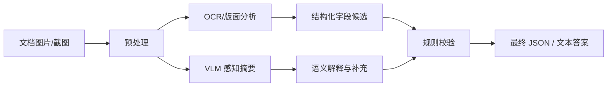

# Extra01 OCR 与文档理解专题

## 与正文如何对照读

本专题补的是“**读字 + 读版面**”这条线，建议在正文里这样挂钩，避免孤立阅读：

| 正文 | 对照点 |
| --- | --- |
| [第二章 视觉编码器与跨模态对齐](../chapter2/第二章%20视觉编码器与跨模态对齐.md) | 小字、密集表格 ↔ patch 粒度与分辨率；先看懂再谈 OCR |
| [第四章 数据与训练](../chapter4/第四章%20数据、训练与微调.md) | OCR/文档类样本、字段一致性、指令模板 |
| [第五章 评测](../chapter5/第五章%20评测体系与工程选型.md) | 五维里的“OCR / 文档”维；用自家票据/截图建小集 |
| [第六章 部署](../chapter6/第六章%20推理部署与%20Serving.md) | 上传压缩、预处理别把字糊掉；日志里要能还原原图信息 |
| [第八章 Demo](../chapter8/第八章%20构建一个图像问答%20Demo.md) | 结构化输出（JSON/字段）比纯段落更适合文档抽取 |
| [第九章 Agent](../chapter9/第九章%20从单模态%20Agent%20到多模态%20Agent.md) | OCR/版面可拆成工具分支，与 VLM 分工 |

## 一、为什么 OCR 和文档理解值得单独开专题

很多人第一次接触多模态大模型时，会下意识认为“模型既然能看图，就应该顺便能读文档、读截图、读表格”。现实通常不是这样。

自然图像理解和文档理解虽然都属于多模态，但它们对模型的要求明显不同：

- 自然图像更关注对象、场景、关系与常识
- 文档理解更关注文字精度、版面结构、字段边界与阅读顺序

这也是为什么一个能把风景图描述得很好的模型，面对发票、网页后台截图、合同页面、表格报表时，可能突然表现一般。

## 二、OCR 不等于文档理解

这两个概念经常被混用，但它们解决的问题并不一样。

### 1. OCR

OCR 的核心任务是把图片中的文字识别出来。它解决的是“读到了什么字”。

### 2. 文档理解

文档理解除了识字，还要理解：

- 这些文字在页面中的结构关系
- 哪部分是标题、正文、页眉、页脚
- 哪些单元格属于同一行同一列
- 哪些字段是键，哪些是值
- 哪些元素是图表、印章、签名、复选框

所以 OCR 更像“提字”，文档理解更像“读懂文档”。

## 三、常见文档理解场景

### 1. 票据与发票

重点在字段抽取和格式稳定性，例如：

- 商户名
- 时间
- 金额
- 税号

### 2. 合同与报告

重点在版面结构、条款定位、摘要和关键信息提取。

### 3. 网页与后台截图

重点在：

- 界面元素识别
- 报错信息定位
- 按钮、标签、表单项解释

### 4. 表格与报表

重点在单元格关系、行列对齐、统计口径和趋势归纳。

## 四、为什么通用 VLM 在 OCR 场景里容易出问题

通用视觉语言模型在 OCR 和文档理解场景里常见的问题包括：

- 漏读小字
- 数字识别错误
- 阅读顺序错乱
- 表格跨行跨列关系丢失
- 把“没看清”补成“猜测答案”

本质原因通常有三类：

1. 输入分辨率不够，细节在进入模型前就损失了。
2. 训练数据里 OCR / 文档类样本不足。
3. 模型更偏生成式回答，而不是稳定结构化抽取。

## 五、工程上更稳的 OCR / 文档理解工作流

在真实系统里，不建议把所有事情都压给一个通用 VLM。更稳妥的做法通常是组合工作流：



这个流程的关键不是“更复杂”，而是把任务拆成了更稳定的部分：

- OCR 工具负责识字
- 版面分析工具负责结构
- VLM 负责语义理解、归纳和自然语言解释
- 规则层负责最后兜底

## 六、一个实战案例：票据字段抽取

> 与正文 [第八章第十节](../chapter8/第八章%20构建一个图像问答%20Demo.md#十进阶实战把-demo-扩成场景应用) 互补：第八章侧重 Demo 界面实现，这里侧重工作流设计和字段校验。

如果你想做一个简单的票据或发票抽取器，可以按下面的最小链路走：

### 第一步：定义目标字段

先不要一上来就抽一切，先限定字段，例如：

- 商户名
- 日期
- 总金额
- 支付方式

### 第二步：先做 OCR

把识别出的文本和坐标拿出来，而不是直接让模型“猜”。

### 第三步：把 OCR 结果和原图一起喂给 VLM

让模型做两件事：

1. 基于 OCR 文本纠错和归并
2. 基于页面结构判断哪个字段更可信

### 第四步：规则校验

例如：

- 金额必须是数字格式
- 日期需要满足时间格式
- 必填字段为空时返回人工确认

## 七、一个实战案例：截图报错分析

截图类任务和票据不同，它往往更偏“界面理解 + 语义解释”。

你可以这样拆：

1. OCR 提取错误文本和按钮标签
2. VLM 判断界面上下文，例如这是登录页、数据库页还是 IDE
3. 检索系统文档或 FAQ
4. 生成“问题解释 + 下一步建议”

这类场景里，VLM 最擅长的是“理解上下文和组织解释”，而不是“逐字逐句 100% 精确读取”。

## 八、Prompt 设计建议

在 OCR / 文档理解场景里，Prompt 不应只写“请提取关键信息”，而应更具体：

```text
请阅读这张票据图片，输出 JSON：
{
  "merchant_name": "",
  "date": "",
  "total_amount": "",
  "payment_method": ""
}

要求：
1. 如果字段无法确认，填 null。
2. 不要编造图片中不存在的信息。
3. 保留原始单位和金额格式。
```

这样的 Prompt 有三个好处：

1. 限制输出格式
2. 降低幻觉空间
3. 更方便后续接规则校验

## 九、做 OCR / 文档理解时最值得优先优化什么

如果你时间有限，建议优先优化这四件事：

1. 输入图像质量
2. 长图与高分辨率处理方式
3. 输出格式约束
4. 失败回退机制

不要一开始就急着换模型。很多时候，真正的问题来自：

- 图太糊
- 图被压缩过
- 页面太长被缩小
- 输出要求过于开放

## 十、和主章节的衔接建议

这一专题最适合和下面几章结合阅读：

- 第五章：你可以把票据、截图、表格样本加入自己的评测集
- 第六章：你会更清楚为什么长图和高分辨率输入会影响部署成本
- 第八章：你可以把 Demo 改造成“截图分析助手”或“字段抽取助手”
- 第九章：你可以把 OCR 工具接进多模态 Agent

## 十一、章末练习

1. 解释为什么 OCR 和文档理解不是同一件事。
2. 设计一个 10 条样本的小型票据抽取测试集。
3. 写一个适用于“报错截图分析”的输出模板。
4. 说明为什么在文档场景里，规则校验通常是必要的。

