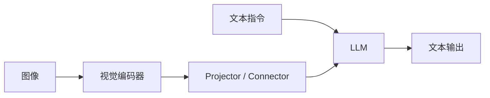

# 第三章 多模态生成架构

> **理论篇**（第 1～4 章）：地图、视觉编码与对齐、生成架构、数据与微调。

承接 [第二章](../chapter2/第二章%20视觉编码器与跨模态对齐.md)：对齐与视觉 token 清楚之后，本章讲**怎么接到 LLM 上做生成**、常见训练范式，以及为何同样的 Connector + LLM 会做出完全不同的产品形态。

## 一、从“会匹配”到“会生成”

当你理解了视觉编码器和 CLIP 之后，下一步要解决的问题就是：模型怎样从“知道图文相似”进化到“能够围绕图像进行自然语言生成”。

生成式多模态模型的核心，不是把视觉模型和语言模型简单拼起来，而是找到一种代价可控、效果足够好、推理链路稳定的连接方式。

## 二、三条常见架构路线

### 路线 1：双塔检索式

这类模型以图像塔和文本塔为中心，主要做匹配和检索。它们适合：

- 以图搜文 / 以文搜图
- 跨模态分类
- 图文相似度排序

但不适合做复杂开放式生成。

### 路线 2：Connector + LLM

这是目前最常见的 VLM 方案。它的基本结构是：



这一路线最容易工程化，因为可以复用成熟的视觉编码器和成熟的 LLM，只在中间加一个连接模块。若产品里要做**多图比较、版本对照**，输入与提示设计可再结合 [Extra02 多图输入与比较专题](../Extra-Chapter/Extra02-多图输入与比较专题.md)。

### 路线 3：原生统一序列建模

这类模型试图把图像、音频、文本都转成统一 token，再交给同一套 Transformer 建模。简单说就是不用单独的视觉编码器，把图片直接变成 token 和文字一起处理。理论上更统一，模态扩展性也更强，但训练成本、数据要求和系统复杂度通常更高。

### 选型时可以先这么判断

如果你在做第一个版本的选型，可以先用这套简化判断：

1. 目标主要是检索/召回/匹配 → 优先考虑双塔检索式。
2. 目标是图文问答、截图分析、文档助手 → 优先考虑 Connector + LLM。
3. 目标是平台级多模态统一建模，且资源充足 → 再考虑原生统一序列路线。

先把任务目标说清楚，再谈模型名，基本能少踩一半坑。

<div align="center">
  
</div>

架构路线只在回答“能不能接、好不好训”；**真正拉开产品差距的往往是第四章的数据配方与第五章的离线评测**——否则你会陷入“Connector 名都认识，自家截图仍全崩”的常见状态。

## 三、Connector 到底在做什么

Connector 的作用可以简单理解为“翻译器”。

视觉编码器输出的特征空间和语言模型输入 embedding 空间通常不一样，直接硬拼接往往效果很差。Connector 负责把视觉特征变成语言模型可消费的输入。

它可能是：

- 一个线性层
- 一个 MLP
- 一个 Cross-Attention 模块
- 一组可学习 query

不同设计背后，对应的是不同的成本和表达能力取舍。

## 四、BLIP-2：轻量连接的经典范式

BLIP-2 的思路很有代表性：冻结强视觉模型，冻结强语言模型，只训练中间的小模块。

它的关键价值在于说明了一件事：**你不一定要把整个系统全部重新训练，才能让视觉能力接入 LLM。**

BLIP-2 式路线的优点：

- 训练成本相对低
- 容易复用已有模型能力
- 适合资源有限的团队快速验证

局限：

- Connector 容量有限时，复杂细节可能传不过去
- 如果只靠轻量模块，面对高难度 OCR、复杂推理场景时容易吃力

## 五、LLaVA：为什么视觉指令微调很重要

LLaVA 的工程启发非常强：它告诉大家，仅仅完成视觉对齐还不够，还需要“把模型调成一个真正会和用户对话的视觉助手”。

这带来了两个重要变化：

1. 数据形态从普通图文对，扩展到图像 + 指令 + 答案。
2. 训练目标从“语义接近”转向“面向任务的回答质量”。

这一步非常像 NLP 领域从预训练模型走向指令微调模型的过程。

## 六、现代 VLM 常见的两阶段训练

很多多模态生成模型都可以粗略看成两阶段：

### 阶段 1：预对齐

目标是先让视觉特征能够进入语言空间。常见做法是冻结大部分主体，只训练连接模块。

### 阶段 2：指令微调

目标是让模型学会按照用户意图回答问题、遵循格式、完成多轮对话。这个阶段会使用：

- 图文问答数据
- OCR 场景数据
- 图表和文档数据
- 推理数据
- 多轮对话数据

### 两阶段训练笔记模板

我建议你用下面三行去拆任何开源模型：

- `阶段1（预对齐）`：冻结哪些模块？训练哪些连接层？用了哪类图文对数据？
- `阶段2（指令微调）`：覆盖了哪些任务（VQA/OCR/推理/多轮）？是否引入格式约束？
- `推理侧`：最终通过什么接口暴露能力（本地脚本/服务/API）？

这三行能写清楚，说明你已经抓到它的训练主干了。

### 训练日志长什么样（示意）

真实训练时，控制台或日志里常见类似片段（具体字段因框架而异，但读法相通）：

```text
epoch 1/3  step 1200  loss 2.31  lr 1e-4  vision_frozen=True  trainable_params=12.3M
epoch 1/3  step 2400  loss 1.85  ...
epoch 2/3  step 4800  loss 1.42  ...
```

从曲线形态上粗看：同一 epoch 内 loss **平滑缓降**通常正常；若**剧烈锯齿**且伴随梯度告警，常见是学习率过大、batch 过小或混合精度数值问题，需要先稳住训练再谈效果。预对齐阶段 loss 往往先快速下降，指令微调阶段则更看“任务型样本”是否足够、格式是否统一。若 loss 在降但抽样回答仍然模板化，多半是数据分布或 chat template 与推理不一致，第四章会专门讲怎么排这类问题。

## 七、原生统一模型为什么更难

从长期看，统一架构当然很诱人。因为：

- 模态之间不必强行分成“视觉侧”和“语言侧”
- 多模态 token 可以共享更统一的建模范式
- 更容易往音频、视频等模态扩展

但它更难的地方也很明显：

- 训练数据更复杂
- 序列更长
- 预训练成本更高
- 工程细节更多，例如多模态 tokenizer、缓存管理、采样策略

所以对大多数个人学习者和中小团队来说，先理解 Connector 式路线，再研究统一架构，通常是更现实的顺序。

## 八、如何阅读一张多模态架构图

以后你再看到任何 VLM 架构图，建议按以下顺序拆：

1. 视觉输入经过什么编码器？
2. 有没有降采样、query、压缩、投影？
3. 图像特征以什么形式进入 LLM？
4. 训练时更新了哪些模块？
5. 输出是纯文本，还是还能产生结构化动作？

如果这五件事能答出来，基本就能把架构看明白。

## 九、不同路线的工程对比

| 路线 | 优点 | 局限 | 适合场景 |
| --- | --- | --- | --- |
| 双塔检索式 | 快、稳、适合匹配 | 不擅长开放生成 | 检索、召回、分类 |
| Connector + LLM | 工程成熟、扩展快 | 依赖对齐质量 | 图文对话、问答、文档理解 |
| 原生统一建模 | 理论上更统一 | 成本高、复杂度高 | 大规模研究或平台级系统 |

## 十、数据样本到底长什么样（最小印象）

图文指令样本的核心结构很简单：一张图 + 一组多轮对话（user/assistant），存储为 JSONL 格式。同一条样本里，用户指令是否清晰、答案是否可核对、图像路径是否有效，都会直接影响 Connector 与指令微调阶段的效果。

数据样本的完整格式与校验方法将在 [第四章](../chapter4/第四章%20数据、训练与微调.md) 详细展开，这里先建立"长什么样"的直觉即可。

## 十一、你真正需要掌握的不是“模型名”，而是“结构意识”

多模态模型名字很多，容易让人陷入“记模型谱系”的学习方式。但在工程实践里，更重要的是结构意识：

- 视觉侧强不强
- 对齐层怎么做
- 语言侧是否继续训练
- 数据是偏描述、OCR 还是推理

知道这些，你就能解释为什么两个模型在同一个场景里差距很大。

## 十二、实战衔接：如何拆一个开源 VLM 仓库

学完这一章后，建议你找一个开源视觉语言模型仓库，不要急着跑，先做“结构拆解”。

你可以按下面五个问题做笔记：

1. 用的是什么视觉编码器？
2. 图像特征通过什么模块进入 LLM？
3. 训练时冻结了哪些模块？
4. 数据更偏图像描述、OCR、对话，还是推理？
5. 推理接口是原生脚本，还是 OpenAI 兼容服务？

如果你能把这五个问题写清楚，你对架构的理解会比单纯阅读模型介绍深很多。

这一章解决“架构怎么连起来”：**第四章的数据配方质量会直接决定 Connector 训练完之后，在自家截图上是否真的能办事**。同一套“编码器 + Connector + LLM”，差距往往来自下面几条，而不是模型名字：

- 数据覆盖是否贴近任务
- 指令样本质量是否稳定
- 训练策略是否和任务难度匹配

换句话说：Connector 再合理，若 [第四章](../chapter4/第四章%20数据、训练与微调.md) 里的数据配方不对，上线后仍会大面积答非所问或幻觉。请进入该章，把配方、格式与常见坑落到可执行的 JSONL 与训练决策上。

## 十三、章末练习

**动机**：能拆“编码器 / Connector / LLM”后，你在开源仓库里才分得清该改对齐、改数据还是改推理模板，少做无效跟风换模型。

### 必做（5-10 分钟）

1. 为什么说 Connector 是现代多模态生成模型里的关键桥梁？
2. 比较双塔检索式和 Connector + LLM 两条路线的典型适用场景。

### 进阶（20-30 分钟）

1. 解释为什么视觉指令微调对“助手感”很重要。
2. 找一个你感兴趣的模型，试着判断它更接近哪条架构路线，并给出判断依据。

### 挑战（1-2 小时）

1. 选择一个开源 VLM 仓库，按“编码器/Connector/冻结策略/数据类型/推理接口”写一页结构拆解笔记。
2. 为一个具体业务场景（如截图报错助手）写一份架构选型说明：为什么选该路线，不选另两条路线。

## 十四、2024—2026 开源 VLM 一览（速查）

理解了 BLIP-2 和 LLaVA 的范式后，你会发现 2024-2026 年的开源模型基本都是“更强的视觉编码器 + 更聪明的 Connector + 更强的 LLM”这条路线上的演进。下面这张表仅作**速查**，帮助你快速定位当前主流选择；模型规格、许可证与可用性可能继续变化，请以官方模型卡和仓库说明为准。

> 最后核验日期：2026-05-20。若你准备实际选型或商用，请逐项对照官方模型卡、许可证页面和仓库说明再确认。

| 模型 | 参数量 | 视觉编码器 | Connector | 许可证 | 核心亮点 |
|---|---|---|---|---|---|
| **Qwen2.5-VL** | 3B / 7B / 32B / 72B | ViT（Custom）| MLP | Qwen License | M-RoPE 统一位置编码；Naive Dynamic Resolution 自适应分辨率；视频原生支持 |
| **InternVL2.5 / 3** | 2B~78B | InternViT | MLP | Apache 2.0 | Pixel-shuffle 高分辨率处理；AnyRes 任意分辨率策略；中文文档强 |
| **LLaVA-NeXT / OneVision** | 7B~110B | CLIP / SigLIP | MLP | Apache 2.0 | 高分辨率 AnyRes；多图统一处理；OneVision 支持视频 |
| **MiniCPM-V 2.6** | 2.8B / 8B | SigLIP | 压缩模块 | Apache 2.0 | 小参数高性能；端侧友好；OCR 和推理能力超出参数量预期 |
| **DeepSeek-VL2** | 4.5B~27B | SigLIP | MoE Connector | MIT | MoE 架构降低推理成本；强推理和多图能力 |
| **Pixtral** | 12B | Pixtral ViT | 压缩模块 | Apache 2.0 | Mistral 出品；原生支持任意宽高比；长图处理优秀 |
| **Llama 3.2 Vision** | 11B / 90B | 自研 ViT | Cross-Attention | Llama 3.2 License | Meta 官方多模态；与 Llama 生态无缝衔接 |
| **NVLM** | 72B | InternViT | MLP | NVIDIA Open Model License | NVIDIA 开源；推理和文档理解强 |
| **Phi-4-multimodal** | 5.6B | 自研 ViT | MLP | MIT | 微软小参数高性能；音频+图像多模态统一 |
| **Qwen2.5-Omni** | 7B | ViT | MLP | Qwen License | 端到端文本+图像+音频+视频统一理解与生成 |

### 怎么快速选模型

如果你是第一次选 VLM，建议按这个顺序决策：

1. **先看参数预算**：8GB 显存 → 3B~4B 级别（Qwen2.5-VL-3B、MiniCPM-V 2.6）；24GB → 7B~8B；更多 → 32B+
2. **再看任务类型**：文档/OCR 密集 → InternVL、MiniCPM-V；通用对话 → Qwen2.5-VL、LLaVA-NeXT；需要视频 → Qwen2.5-Omni、LLaVA-OneVision
3. **最后看许可证**：商用需排除非商用许可（如部分 Qwen 版本需确认）

### 原生统一多模态路线（另一条线）

除了上述“Connector + LLM”路线，还有一类模型试图从一开始就把所有模态统一成同一种 token：

- **Chameleon**（Meta）：图像和文本都用同一个 tokenizer 离散化，交给同一套 Transformer
- **Fuyu**（Adept）：直接把图像 patch 展平成 token，不经过独立视觉编码器
- **GPT-4o / GPT-4V**（OpenAI，闭源）：端到端原生多模态，具体架构未公开

这条路线的优势是模态间信息损失更少，扩展性更强（音频、视频直接加 token）；劣势是训练成本更高，开源生态目前不如 Connector 路线成熟。对初学者来说，先精通 Connector 路线，再研究原生统一架构，是更务实的顺序。

架构清楚之后，真正拉开差距的是数据与训练；**第四章**从配方、格式到常见坑拆解“为什么同样的 Connector + LLM 效果差很多”，与本章强调的样本质量与训练阶段选择是同一根绳子的两端。

## 十五、本章小结

- 现代多模态生成模型最常见的路线是“视觉编码器 + Connector + LLM”；双塔检索式适合匹配，原生统一建模适合资源充足的大规模研究，但 Connector 路线工程成熟度最高。
- Connector 的本质是把视觉特征翻译成语言模型可消费的表示；预对齐解决“接得上”，指令微调解决“答得好”，两阶段缺一不可。
- 同一套架构，效果差距往往来自数据配方（覆盖任务、样本质量、训练策略），这也是第四章的核心议题。
- 学多模态时，不要只背模型名字，要学会拆系统结构。

## 十六、章节跳转

- 上一篇：[第二章 视觉编码器与跨模态对齐](../chapter2/第二章%20视觉编码器与跨模态对齐.md)
- 下一篇：[第四章 数据、训练与微调](../chapter4/第四章%20数据、训练与微调.md)
- 延伸实践（实战篇）：[第七章 动手跑通你的第一个 VLM](../chapter7/第七章%20动手跑通你的第一个%20VLM.md)
