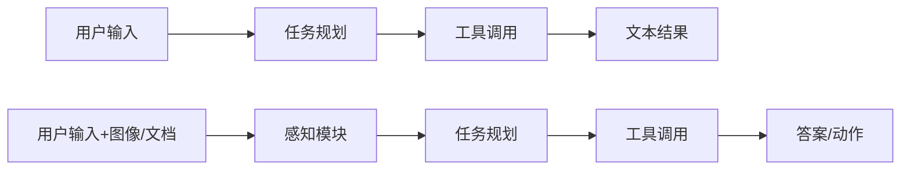

# 第九章 从单模态 Agent 到多模态 Agent

> **实战篇**（第 5～10 章）：评测、部署、推理与 Demo、Agent、学习路线收束。

承接 [第八章](../chapter8/第八章%20构建一个图像问答%20Demo.md)：Demo 多为「单轮图文问答」；本章在同一套多模态调用之上加**规划、工具与记忆**，并强调感知不可靠时的降级——这类失败模式在 [第五章](../chapter5/第五章%20评测体系与工程选型.md) 里应已有记录。

## 一、为什么多模态会直接改变 Agent 的边界

如果一个 Agent 只能处理文本，那它的世界是抽象的、描述性的；一旦它能看图、看截图、看文档、看网页，它就拥有了感知现实任务的入口。

这会直接改变 Agent 能做的事情：

- 从“回答问题”升级为“看见问题”
- 从“读说明书”升级为“读界面、读票据、读文档”
- 从“纯文本推理”升级为“基于视觉证据的决策”

所以多模态不是“锦上添花”，而是很多真实任务里必须补上的那块能力。

**落地顺序建议**（仍属实战篇，但比 Demo 多几层）：1）先做到 [第八章](../chapter8/第八章%20构建一个图像问答%20Demo.md) 级单轮图文稳定；2）为图像增加「感知摘要」一步，避免规划直接啃原图；3）再引入工具分支与简单规则；4）把感知失败时的降级写清，并与 [第五章](../chapter5/第五章%20评测体系与工程选型.md) 记录的失败 `id` 对齐。跳步常见后果是「Agent 框架很漂亮，一上真实截图就不可观测」。

## 二、单模态 Agent 和多模态 Agent 的结构差异



在多模态 Agent 里，你需要额外考虑：

- 感知结果怎么进入规划模块
- 感知错误如何被发现
- 多模态上下文怎样存入记忆

<div align="center">
  
</div>

## 三、多模态 Agent 的四个关键模块

### 1. 感知模块

负责理解图片、截图、文档、表格等输入。

### 2. 规划模块

根据用户目标和感知结果决定下一步：

- 直接回答
- 调用 OCR
- 调用搜索
- 调用结构化解析

### 3. 工具模块

多模态 Agent 往往需要更多工具配合，例如：

- OCR 工具
- 图像裁剪工具
- 网页解析工具
- 文件读取工具
- 检索工具

### 4. 记忆模块

保存图像摘要、关键字段、用户历史偏好、多轮任务上下文。

## 四、一个典型案例：截图助手 Agent

假设用户给你一张报错截图，并说：

> 这个错误是什么意思，下一步我应该怎么处理？

一个合格的多模态 Agent 处理流程可能是：

1. 先通过视觉模型读取截图内容。
2. 提取关键错误码、报错位置、按钮和上下文。
3. 判断是否需要调用文档检索或本地知识库。
4. 生成面向用户的解释和下一步操作建议。

这个流程里，多模态模型负责”感知”，而 Agent 负责”组织与行动”。

> 如果截图是长图（如包含顶部导航 + 中间报错 + 底部日志），直接整图处理容易漏细节。此时需要结合切块策略，详见 [Extra03 长图处理与切块策略专题](../Extra-Chapter/Extra03-长图处理与切块策略专题.md)。

## 五、什么时候别把所有事都压给一个 VLM

虽然很多模型能直接看图回答，但真正做系统时，最好避免把所有任务都压给一个通用模型。

更稳的方式通常是：

- VLM 负责理解和摘要
- OCR 专用工具负责提字
- 检索模块负责补知识
- 规则层负责结构校验

原因很现实：VLM 很强，但并不是每个环节都最稳、最省成本。

## 六、构建多模态 Agent 时要优先想清楚什么

### 1. 图像在流程中的作用是什么

它是：

- 主要证据
- 辅助上下文
- 触发器
- 还是待抽取对象

不同作用会决定你是否需要高精度 OCR、细粒度定位、多图比较等能力。

### 2. 输出最终要落成什么形式

是自然语言说明，还是结构化 JSON，还是自动化动作？

### 3. 出错时如何回退

例如：

- 看不清就让用户重传
- OCR 失败就切换工具
- 结构化字段缺失就返回人工确认

## 七、一个可直接上手的多模态 Agent 模板

按下面这个模板就能快速搭出原型：

1. 用户输入文本 + 图片
2. 用 VLM 生成图像摘要和关键字段
3. 将摘要写入 Agent 上下文
4. Planner 判断是否需要调用额外工具
5. 执行工具并拿回结果
6. 汇总为最终答案

这个模板几乎适用于：

- 截图助手
- 文档助手
- 电商商品图助手
- 质检助手
- 教学批改助手

## 九、实战：从一个 Agent 骨架开始

为了让本章不只停留在设计层面，仓库补充了一个最小 Agent 骨架：

- `docs/chapter9/app/agent_workflow_demo.py`
- `docs/chapter9/app/requirements.txt`
- `docs/chapter9/app/.env.example`

这个骨架做的事情很克制：

1. 先调用多模态模型生成图像摘要。
2. 根据任务类型决定是否调用额外工具。
3. 将感知结果、工具结果和用户目标汇总成最终答案。

这一版脚本还补了最基本的输入校验和异常返回，方便你后续继续往真实工作流扩展，而不是停留在“理想路径跑通”。

直接这样运行即可：

```powershell
pip install -r docs/chapter9/app/requirements.txt
$env:OPENAI_BASE_URL="你的真实接口"
$env:OPENAI_API_KEY="你的真实密钥"
$env:MODEL_ID="你的真实模型名"
$env:IMAGE_PATH="docs/chapter5/code/images/sample_ui.png"
$env:QUESTION="请分析这张截图并给出下一步建议。"
python docs/chapter9/app/agent_workflow_demo.py
```

### 关于工具路由的说明（重要）

`agent_workflow_demo.py` 使用**关键字匹配**（`if "报错" in summary`）做工具路由，这是教学简化写法，优点是代码少、好理解；缺点是扩展性差、容易误判。

如果你要做生产环境或继续扩展，建议改用 **`agent_workflow_v2.py`**：

- 使用 OpenAI 标准的 **tool-calling JSON schema** 定义工具
- 让模型自己决定是否调用工具、调用哪个工具、传什么参数
- 天然支持多工具组合、参数校验、错误回退

运行方式相同，只是换文件名：

```bash
python docs/chapter9/app/agent_workflow_v2.py
```

**学习建议**：先跑通 v1 理解「感知 → 路由 → 工具 → 汇总」的链路，再读 v2 的代码理解 schema 写法。两者并存，方便对照。

Linux / macOS：把上述 `set` 换成对应的 `export` 即可，例如：

```bash
pip install -r docs/chapter9/app/requirements.txt
export OPENAI_BASE_URL=http://127.0.0.1:8000/v1
export OPENAI_API_KEY=EMPTY
export MODEL_ID=your-vlm
export IMAGE_PATH=docs/chapter5/code/images/sample_ui.png
export QUESTION=请分析这张截图并给出下一步建议。
python docs/chapter9/app/agent_workflow_demo.py
```

（未设置 `IMAGE_PATH` 时，同样会按 `docs/learner_paths.py` 规则尝试第五章占位图；需先在 `docs/chapter5/code` 运行 `create_placeholder_images.py`。）

它不是一个完整框架，但很适合拿来继续改造成：

- 截图助手
- 文档分析助手
- 图片审核助手
- 商品图运营助手

## 十、章末练习

**动机**：Agent 章练的是「感知会错时怎么活」；练完你能画出规划/工具/兜底路径，并与第五章记过的失败模式逐条对上。

### 必做（约 20 分钟）

1. 画出你自己的多模态 Agent 流程图。
2. 说明在你的场景里，哪些步骤必须由 VLM 完成，哪些更适合交给工具。

### 进阶（约 40 分钟）

1. 修改 `agent_workflow_demo.py`，增加一个简单工具分支（例如 OCR 或知识检索占位函数），并在日志里打印「走了哪条分支」。

### 挑战（1～2 小时）

1. 写清感知失败时的降级策略（重试、换工具、要求用户重传、人工兜底），并与 [第五章](../chapter5/第五章%20评测体系与工程选型.md) 里记录的失败模式逐条对应。

## 十二、这一章的核心结论

- 多模态让 Agent 从“只能聊天”升级到“能感知现实输入”。
- 真正稳定的多模态 Agent 通常是“VLM + 工具 + 规划”的组合，而不是单模型包打天下。
- 做系统时，一定要区分感知、规划、执行、记忆四个环节。

**第十章**把这些收成可执行的迭代主线：[第四章](../chapter4/第四章%20数据、训练与微调.md) 数据、[第五章](../chapter5/第五章%20评测体系与工程选型.md) 评测、[第六章](../chapter6/第六章%20推理部署与%20Serving.md) 部署与本章工作流，下面收成一条你能照着跑 30 天的路线，避免学完就散。

## 十三、章节跳转

- 上一篇：[第八章 构建一个图像问答 Demo](../chapter8/第八章%20构建一个图像问答%20Demo.md)
- 下一篇：[第十章 学习路线与开源项目实战建议](../chapter10/第十章%20学习路线与开源项目实战建议.md)
- 配套代码：[app 目录](./app)（仓库路径 `docs/chapter9/app`）
- 延伸专题：[Extra01 OCR 与文档理解专题](../Extra-Chapter/Extra01-OCR与文档理解专题.md)
